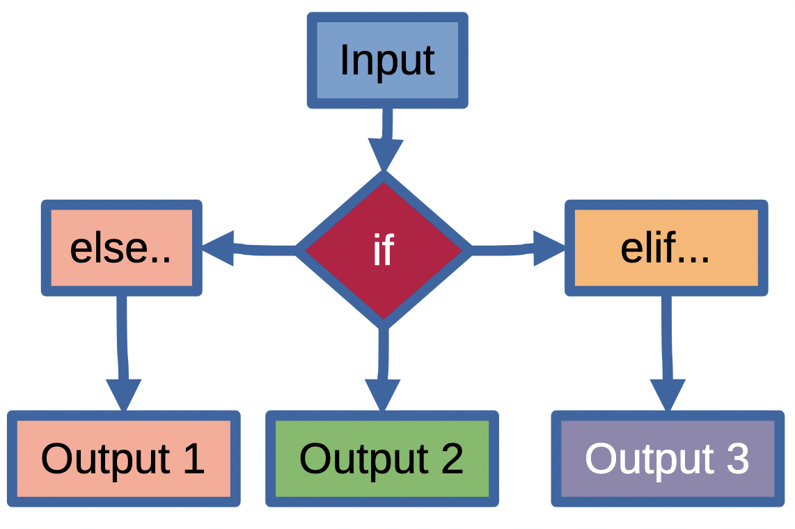

# Activity 06 - Build a Better Algorithm: Complexity Through Creative Reasoning

CMPSC101 :: Fall 2025 :: Modern Python Project with uv

**Assigned**: 23 October 2025
**Due**: 23 October 2025 End of class (Cut off due date and time).



Welcome to an interactive exploration of algorithm efficiency through hands-on analysis and creative reasoning.

We are building off work and understanding gained from our previous activity (Activity_05) concerning algorithmic complexity. Now, we advance into more important algorithm detective work! Here we choose from four different algorithms that solve distinct problems.

In this activity, you will run experiments, analyze timing patterns (as before), and discover why some approaches are fundamentally more efficient than others. In other words, you will discover why some algorithms are "better" than others at completing similar types of work. This creative reasoning approach will give you deep intuition about algorithm complexity that goes beyond just memorizing the definitions of Big-O notation (O(1), O(n), O(n^2), etc.)

## General Idea of this  Activity

Choose an algorithm that intrigues you using the provided Python code, run some guided experiments, and discover the fascinating patterns that emerge from different approaches to problem-solving. The results are plotted to help you see the differences clearly.

**Remember**: The goal isn't just to run the guided experiments, but (instead) to develop creative reasoning about why certain algorithms are more efficient than others. This understanding will serve you well throughout your programming journey.

## Learning Objectives

By the end of this activity, you will be able to:

* Compare different algorithmic approaches to similar problems
* Predict algorithm performance based on complexity analysis
* Use creative reasoning to understand why certain algorithms scale better
* Apply Big-O analysis to choose appropriate algorithms for different scenarios
* Conduct meaningful performance experiments and interpret results

## Quick Start to run Experiments

**Run the program using uv**:

```bash
uv run src/main.py
```

### What To Do

1. **Explore**: Choose an algorithm that interests you
2. **Understand**: Learn how it works step-by-step  
3. **Predict**: Reason about its expected performance
4. **Experiment**: Run timing tests with increasing input sizes
5. **Analyze**: Compare predictions with actual results
6. **Reason**: Understand why the patterns emerge
7. **Reflect**: Summarize your insights in the provided `writing/reflection.md` file.

### Example Reasoning Process

Below are some ideas about how to think through an algorithm before (even during) running experiments.

**Problem**: "How should I to determine if the number 42 exists in a list".

**Two Approaches toi choose:**

* **Linear Search (O(n))**: Check each element one-by-one until finding the number 42 in the group
* **Binary Search (O(log n))**: If the list is sorted, eliminate half the possibilities each step, and seach the remaining half.

**Creative Reasoning**:
When you understand how each algorithm works, you can make predictions about their performance. For instance, you would be able to make the following observations.

- Linear search might check 1000 elements in the worst case
- Binary search eliminates half each time: 1000 → 500 → 250 → 125 → ... (only ~10 steps!)
- **Prediction**: Binary search should be much faster for large lists
- **Experiment**: Test both with different list sizes to confirm what you think you know!

## Four Algorithms to Test

There are four distinct algorithm challenges to choose from. Each one illustrates a different complexity class and problem-solving approach. Choose one or two to explore in depth!

### 🎯 Algorithm 1: Array Access (O(1) - Constant Time)

**The Problem**: Get the value at position 5 in a list of 1 million elements.

**The Algorithm**: Direct memory access using indexing

```python
result = data[5]  # Instant access regardless of list size!
```

**Why It's Fast**: Arrays store elements in consecutive memory. The computer calculates the exact address mathematically, so list size doesn't matter.

**Real-World Examples**:

- Looking up a student's grade by ID number
- Accessing a specific pixel in an image
- Getting today's temperature from a weather array

---

### 🔍 Algorithm 2: Binary Search (O(log n) - Logarithmic Time)

**The Problem**: Find if the number 847 exists in a sorted list of 1 million numbers.

**The Algorithm**: Divide and conquer approach

```python
# Start with middle element
# If middle > target: search left half  
# If middle < target: search right half
# Repeat until found or eliminated all possibilities
```

**Why It's Efficient**: Each step eliminates half the remaining possibilities. Even with 1 million elements, you only need about 20 steps maximum!

**Real-World Examples**:

- Looking up a word in a dictionary
- Finding a book in a library using the catalog system
- Database index lookups

---

### 🔎 Algorithm 3: Linear Search (O(n) - Linear Time)

**The Problem**: Find if the number 847 exists in an *unsorted* list of 1 million numbers.

**The Algorithm**: Brute force checking
```python
# Check element 1: Is it 847? No...
# Check element 2: Is it 847? No...
# ...continue until found or end of list
```

**Why It Takes Time**: Without sorting, we might need to check every single element. Doubling the list size doubles the worst-case time.

**Real-World Examples**:

- Finding your keys by checking every pocket
- Looking for a specific file in an unorganized folder
- Finding a contact in an unsorted phone book

---

### 👥 Algorithm 4: Find All Pairs (O(n²) - Quadratic Time)

**The Problem**: In a list of ages [25, 30, 20, 35, 15], find all pairs that sum to 50.

**The Algorithm**: Nested loops to check every combination

```python
# For each person, check them with every other person:
# 25+30=55 (no), 25+20=45 (no), 25+35=60 (no), 25+15=40 (no)
# 30+20=50 (yes!), 30+35=65 (no), 30+15=45 (no)
# 20+35=55 (no), 20+15=35 (no)
# 35+15=50 (yes!)
```

**Why It's Slow**: For n people, we check roughly n × n = n² combinations. Double the people, quadruple the work!

**Real-World Examples**:

- Finding compatible team members based on skills
- Matching people for optimal partnerships
- Checking all possible connections in a network

## What To Do?

### Step 1: Setup Your Environment

This project uses **uv** for modern Python package management. All dependencies are automatically managed through the `pyproject.toml` file.

```bash
# Dependencies are automatically installed when you run:
uv run python src/main.py
```

### Step 2: Choose Your Algorithm Adventure

The program will present you with four algorithms to test.

**Option 1: Single Algorithm Deep Dive (Recommended First)**

- Choose one algorithm to study in detail
- Learn exactly how it works step-by-step
- Run experiments with different input sizes
- Analyze the performance patterns

**Option 2: Algorithm Comparison Mode**

- Select 2-4 algorithms to compare side-by-side
- See how they scale differently as input grows
- Create visual plots showing performance differences

### Step 3: Run Your Experiments

For each algorithm you choose, the program will:

1. **Explain the Algorithm**: Step-by-step breakdown of how it works
2. **Set Experiment Parameters**: Choose input sizes to test (e.g., 100, 200, 400, 800)
3. **Run Timing Experiments**: Measure actual execution time for each size
4. **Calculate Performance Ratios**: Compare consecutive measurements
5. **Analyze Patterns**: Confirm if results match expected complexity

### Step 4: Analyze Your Results

**Example Output for Linear Search:**

``` text
Size     | Time (sec)   | Ratio   | Operations
---------|--------------|---------|------------
100      | 0.000012     | ─       | 100
200      | 0.000024     | 2.00    | 200  
400      | 0.000048     | 2.00    | 400
800      | 0.000096     | 2.00    | 800

✓ GOOD: Ratios close to 2.0 confirm linear time O(n)
```

**What This Tells You**: Doubling the input consistently doubles the time, confirming O(n) linear complexity.

## Understanding the Results

### Constant Time O(1) - Array Access

```
Pattern: Time stays roughly the same
Ratios: Close to 1.0
Why: Direct memory access doesn't depend on list size
```

### Logarithmic Time O(log n) - Binary Search

```
Pattern: Time grows very slowly
Ratios: 1.0 to 1.5 (small increases)
Why: Each step eliminates half the remaining possibilities
```

### Linear Time O(n) - Linear Search

```
Pattern: Time doubles when input doubles  
Ratios: Close to 2.0
Why: Potentially need to check every element
```

### Quadratic Time O(n²) - Find All Pairs

```
Pattern: Time quadruples when input doubles
Ratios: Close to 4.0  
Why: Nested loops create n × n operations
```

## Technical Features

### Interactive Algorithm Selection

- Choose which algorithm(s) to study
- Detailed explanations before running experiments
- Flexible input size configuration

### Comprehensive Analysis

- Automatic timing measurements
- Performance ratio calculations  
- Pattern recognition and validation
- Visual plots (when matplotlib available)

### Educational Focus

- Step-by-step algorithm explanations
- Real-world application examples
- Creative reasoning approach to complexity
- Immediate feedback on experimental results

### Deliverables

This is a check-mark grade.

- **Primary**: Completed `writing/reflection.md` with thoughtful analysis
- **Optional**: Screenshots of experimental results or generated plots

---

## GatorGrade

You can check the baseline writing and commit requirements for this lab assignment by running department's assignment checking `gatorgrade` tool. To use `gatorgrade`, you first need to make sure you have Python3 installed (type `python --version` or `python3 --version` to check). If you do not have Python installed, please see:

* [Setting Up Python on Windows](https://realpython.com/lessons/python-windows-setup/)
* [Python 3 Installation and Setup Guide](https://realpython.com/installing-python/)
* [How to Install Python 3 and Set Up a Local Programming Environment on Windows 10](https://www.digitalocean.com/community/tutorials/how-to-install-python-3-and-set-up-a-local-programming-environment-on-windows-10)

Then, if you have not done so already, you need to install `gatorgrade`:

* First, [install `pipx`](https://pypa.github.io/pipx/installation/)
* Then, install `gatorgrade` with `pipx install gatorgrade`

Finally, you can run `gatorgrade`:

`gatorgrade --config config/gatorgrade.yml`


## Development Resources

* [Big-O Complexity Analysis](https://www.bigocheatsheet.com/) - Visual complexity reference
* [Algorithm Visualizations](https://visualgo.net/) - See algorithms in action
* [Python Performance Tips](https://wiki.python.org/moin/PythonSpeed/PerformanceTips) - Optimization techniques

**Good luck exploring the world of algorithm complexity!** 🚀

---

*Ready to discover which algorithm reigns supreme? Let the experiments begin!*